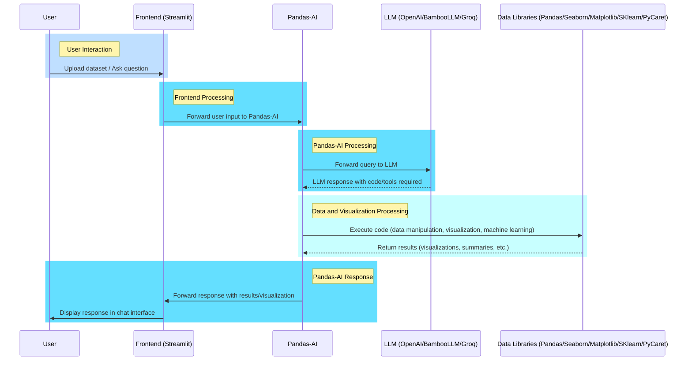

```mermaid
sequenceDiagram
    participant U as User
    participant F as Frontend (Streamlit)
    participant P as Pandas-AI
    participant L as LLM (OpenAI/BambooLLM/Groq)
    participant D as Data Libraries (Pandas/Seaborn/Matplotlib/SKlearn/PyCaret)
    
    rect rgb(191, 223, 255)
    note right of U: User Interaction
        U->>F: Upload dataset / Ask question
    end
    
    rect rgb(100, 223, 255)
    note right of F: Frontend Processing
        F->>P: Forward user input to Pandas-AI
    end
    
    rect rgb(100, 223, 255)
    note right of P: Pandas-AI Processing
        P->>L: Forward query to LLM
        L-->>P: LLM response with code/tools required
    end
    
    rect rgb(200, 255, 255)
    note right of P: Data and Visualization Processing
        P->>D: Execute code (data manipulation, visualization, machine learning)
        D-->>P: Return results (visualizations, summaries, etc.)
    end
    
    rect rgb(100, 223, 255)
    note right of P: Pandas-AI Response
        P->>F: Forward response with results/visualization
        F->>U: Display response in chat interface
    end
```
